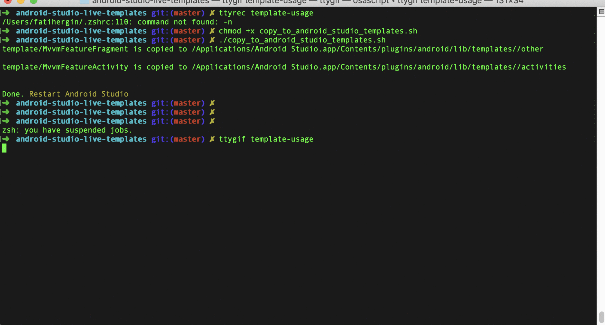

# Mvvm Template

 :rocket: Android Studio templates to make android development easier and faster.
 
---

### Setup

Template files should be moved to `$ANDROID_STUDIO_FOLDER$/Contents/plugins/android/lib/templates/`


##### Move via bash script

Run the install script at the root of this repository:

> 1. Make given script executable 🔨
```shell
    $ chmod +x ./copy_to_android_studio_templates.sh 
```

> 2. Move templates to relevant path
```shell
    $ ./copy_to_android_studio_templates.sh 
```




### Usage


